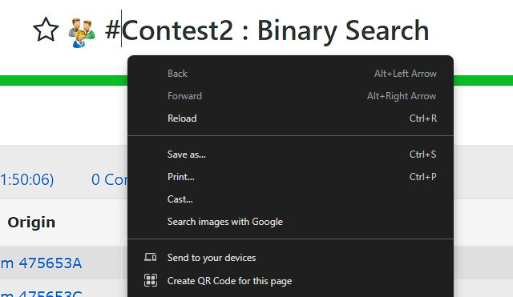
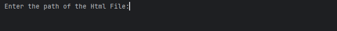
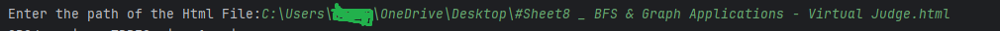
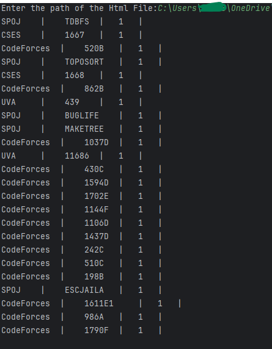
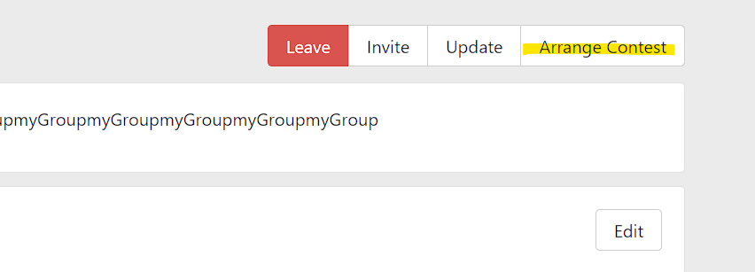
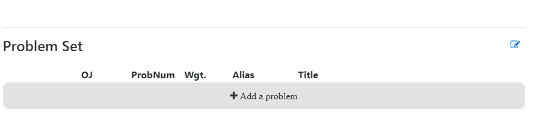
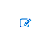
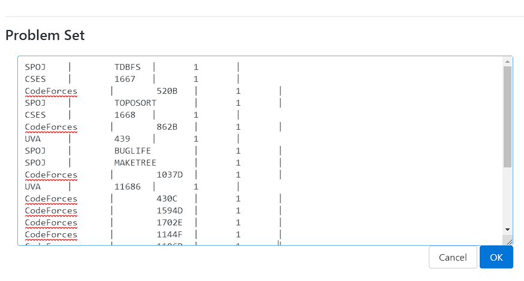
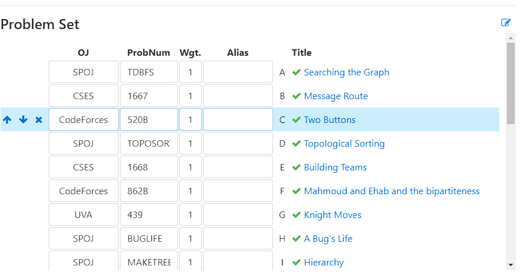

# VJudge Problem Set Extractor

This Python script is designed for extracting problems from VJudge with VJudge format for private contests that can't be cloned. It utilizes the BeautifulSoup library for parsing HTML.

## Dependencies
#### - python 3
#### - BeautifulSoup4 (bs4)

## How to use?
1. Download the HTML page of the contest from VJudge that you want to extract problems from.
2. Get the path of the downloaded HTML file.
3. Run the program and provide the path to the HTML file.
4. The program will automatically find the problems with their IDs and format them in VJudge problem set format.
5. Add the problem set to Vjudge with Vjudge Format
### How to Run?
#### How to Run in powerShell or in bash 

```
python main.py
```

### How to download Contest as Html File?
- 
- #### then you select Save as 

### Program Run
- 
- #### Run the program

- 
- #### Enter path of the Html Contest File

### OutPut Format

- #### the output will be in Vjudge Format Like the picture below
- 


### How to use the Vjudge Format on Vjudge 

- #### 1. Go to any group and Choose Arrange Contest


- #### 2. Go Down to the Problem Set !
    

- #### 3. Press on Edit Button !
    
- 
- #### 4. Copy the output of the code and past in the problem set!
    
- 
- #### 5. then you will found the problem set exist in the problem set!
    
